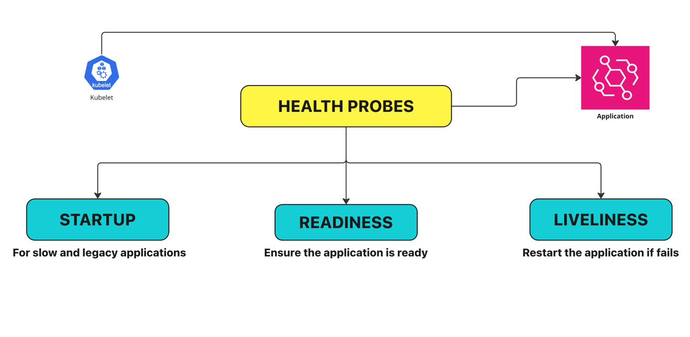

# Health Probes in Kubernetes

## 1. What is prob..?
To investigatee or monitor something and take necessary actions

## 2. What is health probes in kubernetes..?
Health probes monitors your k8 applications and take necessary actions to recover from failure
To enusre your application is highly available and self-healing 



```yaml
apiVersion: v1
kind: Pod
metadata:
  labels:
    test: liveness
  name: liveness-exec
spec:
  containers:
  - name: liveness
    image: registry.k8s.io/busybox
    args:
    - /bin/sh
    - -c
    - touch /tmp/healthy; sleep 30; rm -f /tmp/healthy; sleep 600
    livenessProbe:
      exec:
        command:
        - cat
        - /tmp/healthy
      initialDelaySeconds: 5
      periodSeconds: 5
```

```commandline
08:22:47 manojkrishnappa@Manojs-MacBook-Pro 05-Probes ±|main ✗|→ kubectl get pods
kubectl --context kind-manoj-cka-cluster -n default get pods
NAME            READY   STATUS    RESTARTS   AGE
liveness-exec   1/1     Running   0          43s
08:22:50 manojkrishnappa@Manojs-MacBook-Pro 05-Probes ±|main ✗|→ kubectl get pods --watch
kubectl --context kind-manoj-cka-cluster -n default get pods --watch
NAME            READY   STATUS    RESTARTS   AGE
liveness-exec   1/1     Running   0          50s
liveness-exec   1/1     Running   1 (3s ago)   79s
liveness-exec   1/1     Running   2 (3s ago)   2m34s

```
```yaml
apiVersion: v1
kind: Pod
metadata:
  name: hello
spec:
  containers:
  - name: liveness
    image: registry.k8s.io/e2e-test-images/agnhost:2.40
    args:
    - liveness
    livenessProbe:
      httpGet:
        path: /healthz
        port: 8080
      initialDelaySeconds: 3
      periodSeconds: 3
    readinessProbe:
      httpGet:
        path: /healthz
        port: 8080
      initialDelaySeconds: 15
      periodSeconds: 10
```
```commandline
08:28:13 manojkrishnappa@Manojs-MacBook-Pro 05-Probes ±|main ✗|→ kubectl apply -f example2.yml 
kubectl --context kind-manoj-cka-cluster -n default apply -f example2.yml
pod/hello created
08:28:23 manojkrishnappa@Manojs-MacBook-Pro 05-Probes ±|main ✗|→ kubectl get pods
kubectl --context kind-manoj-cka-cluster -n default get pods
NAME            READY   STATUS              RESTARTS      AGE
hello           0/1     ContainerCreating   0             2s
liveness-exec   1/1     Running             4 (77s ago)   6m18s
```

```commandline
08:28:59 manojkrishnappa@Manojs-MacBook-Pro 05-Probes ±|main ✗|→ kubectl get pods
kubectl --context kind-manoj-cka-cluster -n default get pods
NAME            READY   STATUS    RESTARTS      AGE
hello           0/1     Running   1 (13s ago)   46s
liveness-exec   1/1     Running   5 (46s ago)   7m2s
08:29:09 manojkrishnappa@Manojs-MacBook-Pro 05-Probes ±|main ✗|→ kubectl describe pod hello
kubectl --context kind-manoj-cka-cluster -n default describe pod hello
Name:             hello
Namespace:        default
Priority:         0
Service Account:  default
Node:             manoj-cka-cluster-worker3/172.18.0.5
Start Time:       Sat, 08 Feb 2025 20:28:23 +0530
Labels:           <none>
Annotations:      <none>
Status:           Running
IP:               10.244.1.6
IPs:
  IP:  10.244.1.6
Containers:
  liveness:
    Container ID:  containerd://c1ba46534f363712b4dd8de8b9de48f48b5c7fd425f082032525ed15a3b03061
    Image:         registry.k8s.io/e2e-test-images/agnhost:2.40
    Image ID:      registry.k8s.io/e2e-test-images/agnhost@sha256:af7e3857d87770ddb40f5ea4f89b5a2709504ab1ee31f9ea4ab5823c045f2146
    Port:          <none>
    Host Port:     <none>
    Args:
      liveness
    State:          Running
      Started:      Sat, 08 Feb 2025 20:29:15 +0530
    Last State:     Terminated
      Reason:       Error
      Exit Code:    2
      Started:      Sat, 08 Feb 2025 20:28:57 +0530
      Finished:     Sat, 08 Feb 2025 20:29:14 +0530
    Ready:          False
    Restart Count:  2
    Liveness:       http-get http://:8080/healthz delay=3s timeout=1s period=3s #success=1 #failure=3
    Readiness:      http-get http://:8080/healthz delay=15s timeout=1s period=10s #success=1 #failure=3
    Environment:    <none>
    Mounts:
      /var/run/secrets/kubernetes.io/serviceaccount from kube-api-access-vq56j (ro)
Conditions:
  Type                        Status
  PodReadyToStartContainers   True 
  Initialized                 True 
  Ready                       False 
  ContainersReady             False 
  PodScheduled                True 
Volumes:
  kube-api-access-vq56j:
    Type:                    Projected (a volume that contains injected data from multiple sources)
    TokenExpirationSeconds:  3607
    ConfigMapName:           kube-root-ca.crt
    ConfigMapOptional:       <nil>
    DownwardAPI:             true
QoS Class:                   BestEffort
Node-Selectors:              <none>
Tolerations:                 node.kubernetes.io/not-ready:NoExecute op=Exists for 300s
                             node.kubernetes.io/unreachable:NoExecute op=Exists for 300s
Events:
  Type     Reason     Age                From               Message
  ----     ------     ----               ----               -------
  Normal   Scheduled  65s                default-scheduler  Successfully assigned default/hello to manoj-cka-cluster-worker3
  Normal   Pulling    65s                kubelet            Pulling image "registry.k8s.io/e2e-test-images/agnhost:2.40"
  Normal   Pulled     50s                kubelet            Successfully pulled image "registry.k8s.io/e2e-test-images/agnhost:2.40" in 15.123s (15.123s including waiting). Image size: 49338537 bytes.
  Normal   Killing    15s (x2 over 33s)  kubelet            Container liveness failed liveness probe, will be restarted
  Warning  Unhealthy  15s (x3 over 33s)  kubelet            Readiness probe failed: HTTP probe failed with statuscode: 500
  Normal   Pulled     15s (x2 over 33s)  kubelet            Container image "registry.k8s.io/e2e-test-images/agnhost:2.40" already present on machine
  Normal   Created    14s (x3 over 50s)  kubelet            Created container liveness
  Normal   Started    14s (x3 over 50s)  kubelet            Started container liveness
  Warning  Unhealthy  3s (x7 over 39s)   kubelet            Liveness probe failed: HTTP probe failed with statuscode: 500

```

```yaml
apiVersion: v1
kind: Pod
metadata:
  name: tcp-pod
  labels:
    app: tcp-pod
spec:
  containers:
  - name: goproxy
    image: registry.k8s.io/goproxy:0.1
    ports:
    - containerPort: 8080
    livenessProbe:
      tcpSocket:
        port: 3000
      initialDelaySeconds: 10
      periodSeconds: 5
```

```commandline
08:29:29 manojkrishnappa@Manojs-MacBook-Pro 05-Probes ±|main ✗|→ kubectl apply -f example3.yml 
kubectl --context kind-manoj-cka-cluster -n default apply -f example3.yml
pod/tcp-pod created
08:31:58 manojkrishnappa@Manojs-MacBook-Pro 05-Probes ±|main ✗|→ kubectl get pods
kubectl --context kind-manoj-cka-cluster -n default get pods
NAME            READY   STATUS              RESTARTS        AGE
hello           0/1     CrashLoopBackOff    5 (68s ago)     3m38s
liveness-exec   1/1     Running             6 (2m23s ago)   9m54s
tcp-pod         0/1     ContainerCreating   0               3s

```

```commandline
08:34:32 manojkrishnappa@Manojs-MacBook-Pro 05-Probes ±|main ✗|→ kubectl describe pod tcp-pod
kubectl --context kind-manoj-cka-cluster -n default describe pod tcp-pod
Name:             tcp-pod
Namespace:        default
Priority:         0
Service Account:  default
Node:             manoj-cka-cluster-worker3/172.18.0.5
Start Time:       Sat, 08 Feb 2025 20:31:58 +0530
Labels:           app=tcp-pod
Annotations:      <none>
Status:           Running
IP:               10.244.1.7
IPs:
  IP:  10.244.1.7
Containers:
  goproxy:
    Container ID:   containerd://a21bbd80e8d4465eb08dd780eaf543bb2eae280a0d01be0f09f17a30c72ca9d9
    Image:          registry.k8s.io/goproxy:0.1
    Image ID:       registry.k8s.io/goproxy@sha256:5334c7ad43048e3538775cb09aaf184f5e8acf4b0ea60e3bc8f1d93c209865a5
    Port:           8080/TCP
    Host Port:      0/TCP
    State:          Running
      Started:      Sat, 08 Feb 2025 20:34:25 +0530
    Last State:     Terminated
      Reason:       Error
      Exit Code:    2
      Started:      Sat, 08 Feb 2025 20:33:24 +0530
      Finished:     Sat, 08 Feb 2025 20:33:44 +0530
    Ready:          True
    Restart Count:  5
    Liveness:       tcp-socket :3000 delay=10s timeout=1s period=5s #success=1 #failure=3
    Environment:    <none>
    Mounts:
      /var/run/secrets/kubernetes.io/serviceaccount from kube-api-access-ftjr6 (ro)
Conditions:
  Type                        Status
  PodReadyToStartContainers   True 
  Initialized                 True 
  Ready                       True 
  ContainersReady             True 
  PodScheduled                True 
Volumes:
  kube-api-access-ftjr6:
    Type:                    Projected (a volume that contains injected data from multiple sources)
    TokenExpirationSeconds:  3607
    ConfigMapName:           kube-root-ca.crt
    ConfigMapOptional:       <nil>
    DownwardAPI:             true
QoS Class:                   BestEffort
Node-Selectors:              <none>
Tolerations:                 node.kubernetes.io/not-ready:NoExecute op=Exists for 300s
                             node.kubernetes.io/unreachable:NoExecute op=Exists for 300s
Events:
  Type     Reason     Age                  From               Message
  ----     ------     ----                 ----               -------
  Normal   Scheduled  2m44s                default-scheduler  Successfully assigned default/tcp-pod to manoj-cka-cluster-worker3
  Normal   Pulling    2m43s                kubelet            Pulling image "registry.k8s.io/goproxy:0.1"
  Normal   Pulled     2m39s                kubelet            Successfully pulled image "registry.k8s.io/goproxy:0.1" in 4.418s (4.418s including waiting). Image size: 1698862 bytes.
  Normal   Created    98s (x4 over 2m39s)  kubelet            Created container goproxy
  Normal   Started    98s (x4 over 2m39s)  kubelet            Started container goproxy
  Warning  Unhealthy  98s (x9 over 2m28s)  kubelet            Liveness probe failed: dial tcp 10.244.1.7:3000: connect: connection refused
  Normal   Killing    98s (x3 over 2m18s)  kubelet            Container goproxy failed liveness probe, will be restarted
  Normal   Pulled     98s (x3 over 2m18s)  kubelet            Container image "registry.k8s.io/goproxy:0.1" already present on machine

```
