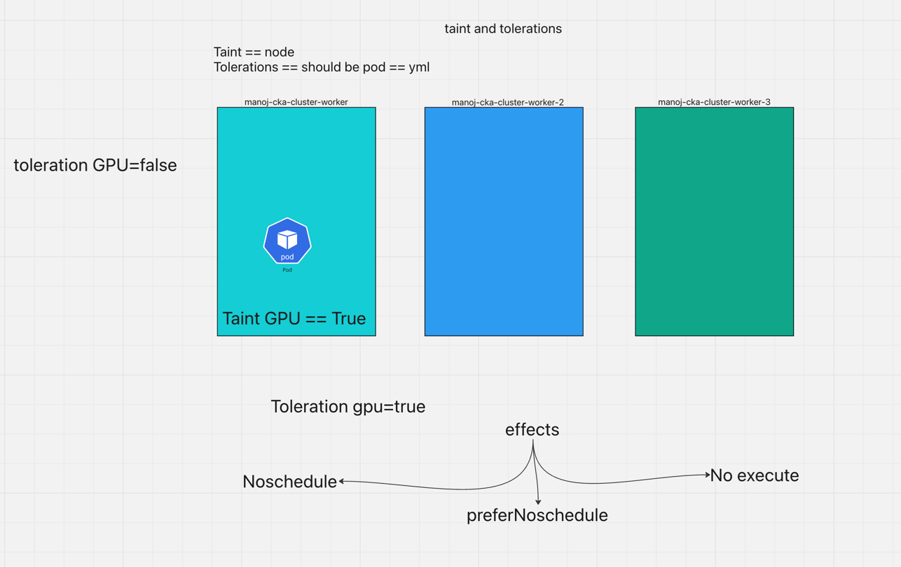

# LABELS AND SELECTORS 

**LABELS:** key value pairs attached to kubernetes objects like pods services and deployment
Env:Production
type:backend
tier:frontend
app: my-app

**SELECTOR:**
example
```yaml
apiVersion: apps/v1
kind: Deployment
metadata:
  name: my-deployment
  labels:
    app: nginx
spec:
  replicas: 10
  selector:
    matchLabels:
      app: nginx
  template:
    metadata:
      labels:
        app: nginx
    spec:
      containers:
      - name: nginx
        image: nginx:1.27
        ports:
        - containerPort: 80

```
```commandline
07:41:50 manojkrishnappa@Manojs-MacBook-Pro kubernetes-docs ±|main ✗|→ kubectl apply -f deployment.yml 
deployment.apps/my-deployment created
07:41:56 manojkrishnappa@Manojs-MacBook-Pro kubernetes-docs ±|main ✗|→ kubectl get pods
NAME                            READY   STATUS    RESTARTS   AGE
my-deployment-87cdd7684-6h462   1/1     Running   0          4s
my-deployment-87cdd7684-77s6v   1/1     Running   0          4s
my-deployment-87cdd7684-bb6vc   1/1     Running   0          4s
my-deployment-87cdd7684-hjfx8   1/1     Running   0          4s
my-deployment-87cdd7684-j78bq   1/1     Running   0          4s
my-deployment-87cdd7684-l74sh   1/1     Running   0          4s
my-deployment-87cdd7684-s7sdv   1/1     Running   0          4s
my-deployment-87cdd7684-t8swn   1/1     Running   0          4s
my-deployment-87cdd7684-w4hxp   1/1     Running   0          4s
my-deployment-87cdd7684-xk9sw   1/1     Running   0          4s
07:42:00 manojkrishnappa@Manojs-MacBook-Pro kubernetes-docs ±|main ✗|→ kubectl get pods --selector app=nginx
NAME                            READY   STATUS    RESTARTS   AGE
my-deployment-87cdd7684-6h462   1/1     Running   0          53s
my-deployment-87cdd7684-77s6v   1/1     Running   0          53s
my-deployment-87cdd7684-bb6vc   1/1     Running   0          53s
my-deployment-87cdd7684-hjfx8   1/1     Running   0          53s
my-deployment-87cdd7684-j78bq   1/1     Running   0          53s
my-deployment-87cdd7684-l74sh   1/1     Running   0          53s
my-deployment-87cdd7684-s7sdv   1/1     Running   0          53s
my-deployment-87cdd7684-t8swn   1/1     Running   0          53s
my-deployment-87cdd7684-w4hxp   1/1     Running   0          53s
my-deployment-87cdd7684-xk9sw   1/1     Running   0          53s
```

# TAINTS AND TOLERATIONS:




```commandline
07:57:17 manojkrishnappa@Manojs-MacBook-Pro kubernetes-docs ±|main ✗|→ kubectl taint node manoj-cka-cluster-worker gpu=true:NoSchedule
node/manoj-cka-cluster-worker tainted
07:58:05 manojkrishnappa@Manojs-MacBook-Pro kubernetes-docs ±|main ✗|→ kubectl taint node manoj-cka-cluster-worker2 gpu=true:NoSchedule
node/manoj-cka-cluster-worker2 tainted
07:58:13 manojkrishnappa@Manojs-MacBook-Pro kubernetes-docs ±|main ✗|→ kubectl taint node manoj-cka-cluster-worker3 gpu=true:NoSchedule
node/manoj-cka-cluster-worker3 tainted
07:58:19 manojkrishnappa@Manojs-MacBook-Pro kubernetes-docs ±|main ✗|→ kubectl run nginx --image=nginx
pod/nginx created
07:58:40 manojkrishnappa@Manojs-MacBook-Pro kubernetes-docs ±|main ✗|→ kubectl get pods
NAME    READY   STATUS    RESTARTS   AGE
nginx   0/1     Pending   0          8s

```
```commandline
08:04:47 manojkrishnappa@Manojs-MacBook-Pro 02-Part-2 ±|main ✗|→ 
08:04:47 manojkrishnappa@Manojs-MacBook-Pro 02-Part-2 ±|main ✗|→ kubectl run myapp --image=nginx --dry-run -o yaml
W0125 20:04:51.013164   80021 helpers.go:702] --dry-run is deprecated and can be replaced with --dry-run=client.
apiVersion: v1
kind: Pod
metadata:
  creationTimestamp: null
  labels:
    run: myapp
  name: myapp
spec:
  containers:
  - image: nginx
    name: myapp
    resources: {}
  dnsPolicy: ClusterFirst
  restartPolicy: Always
status: {}
08:04:51 manojkrishnappa@Manojs-MacBook-Pro 02-Part-2 ±|main ✗|→ 
08:04:51 manojkrishnappa@Manojs-MacBook-Pro 02-Part-2 ±|main ✗|→ kubectl run myapp --image=nginx --dry-run -o yaml >> taint.yaml
W0125 20:05:00.117728   80159 helpers.go:702] --dry-run is deprecated and can be replaced with --dry-run=client.
08:05:00 manojkrishnappa@Manojs-MacBook-Pro 02-Part-2 ±|main ✗|→ 
08:05:00 manojkrishnappa@Manojs-MacBook-Pro 02-Part-2 ±|main ✗|→ ls
Notes.md                demonset.yml            jobs.yml                manul-deployment.yml    taint.yaml
08:05:03 manojkrishnappa@Manojs-MacBook-Pro 02-Part-2 ±|main ✗|→ kubectl apply -f taint.yaml 
Error from server (BadRequest): error when creating "taint.yaml": Pod in version "v1" cannot be handled as a Pod: json: cannot unmarshal bool into Go struct field Toleration.spec.tolerations.value of type string
08:09:09 manojkrishnappa@Manojs-MacBook-Pro 02-Part-2 ±|main ✗|→ kubectl apply -f taint.yaml 
pod/myapp created
08:10:00 manojkrishnappa@Manojs-MacBook-Pro 02-Part-2 ±|main ✗|→ kubectl get pods
NAME    READY   STATUS              RESTARTS   AGE
myapp   0/1     ContainerCreating   0          9s
nginx   0/1     Pending             0          11m
08:10:09 manojkrishnappa@Manojs-MacBook-Pro 02-Part-2 ±|main ✗|→ kubectl get pods
NAME    READY   STATUS              RESTARTS   AGE
myapp   0/1     ContainerCreating   0          12s
nginx   0/1     Pending             0          11m
08:10:12 manojkrishnappa@Manojs-MacBook-Pro 02-Part-2 ±|main ✗|→ kubectl get pods
NAME    READY   STATUS              RESTARTS   AGE
myapp   0/1     ContainerCreating   0          13s
nginx   0/1     Pending             0          11m
08:10:13 manojkrishnappa@Manojs-MacBook-Pro 02-Part-2 ±|main ✗|→ kubectl describe pod myapp
Name:             myapp
Namespace:        default
Priority:         0
Service Account:  default
Node:             manoj-cka-cluster-worker3/172.18.0.3
Start Time:       Sat, 25 Jan 2025 20:10:00 +0530
Labels:           run=myapp
Annotations:      <none>
Status:           Pending
IP:               
IPs:              <none>
Containers:
  myapp:
    Container ID:   
    Image:          nginx
    Image ID:       
    Port:           <none>
    Host Port:      <none>
    State:          Waiting
      Reason:       ContainerCreating
    Ready:          False
    Restart Count:  0
    Environment:    <none>
    Mounts:
      /var/run/secrets/kubernetes.io/serviceaccount from kube-api-access-qzjkp (ro)
Conditions:
  Type                        Status
  PodReadyToStartContainers   False 
  Initialized                 True 
  Ready                       False 
  ContainersReady             False 
  PodScheduled                True 
Volumes:
  kube-api-access-qzjkp:
    Type:                    Projected (a volume that contains injected data from multiple sources)
    TokenExpirationSeconds:  3607
    ConfigMapName:           kube-root-ca.crt
    ConfigMapOptional:       <nil>
    DownwardAPI:             true
QoS Class:                   BestEffort
Node-Selectors:              <none>
Tolerations:                 gpu=true:NoSchedule
                             node.kubernetes.io/not-ready:NoExecute op=Exists for 300s
                             node.kubernetes.io/unreachable:NoExecute op=Exists for 300s
Events:
  Type    Reason     Age   From               Message
  ----    ------     ----  ----               -------
  Normal  Scheduled  23s   default-scheduler  Successfully assigned default/myapp to manoj-cka-cluster-worker3
  Normal  Pulling    23s   kubelet            Pulling image "nginx"
08:10:24 manojkrishnappa@Manojs-MacBook-Pro 02-Part-2 ±|main ✗|→ kubectl describe pod myapp
Name:             myapp
Namespace:        default
Priority:         0
Service Account:  default
Node:             manoj-cka-cluster-worker3/172.18.0.3
Start Time:       Sat, 25 Jan 2025 20:10:00 +0530
Labels:           run=myapp
Annotations:      <none>
Status:           Pending
IP:               
IPs:              <none>
Containers:
  myapp:
    Container ID:   
    Image:          nginx
    Image ID:       
    Port:           <none>
    Host Port:      <none>
    State:          Waiting
      Reason:       ContainerCreating
    Ready:          False
    Restart Count:  0
    Environment:    <none>
    Mounts:
      /var/run/secrets/kubernetes.io/serviceaccount from kube-api-access-qzjkp (ro)
Conditions:
  Type                        Status
  PodReadyToStartContainers   False 
  Initialized                 True 
  Ready                       False 
  ContainersReady             False 
  PodScheduled                True 
Volumes:
  kube-api-access-qzjkp:
    Type:                    Projected (a volume that contains injected data from multiple sources)
    TokenExpirationSeconds:  3607
    ConfigMapName:           kube-root-ca.crt
    ConfigMapOptional:       <nil>
    DownwardAPI:             true
QoS Class:                   BestEffort
Node-Selectors:              <none>
Tolerations:                 gpu=true:NoSchedule
                             node.kubernetes.io/not-ready:NoExecute op=Exists for 300s
                             node.kubernetes.io/unreachable:NoExecute op=Exists for 300s
Events:
  Type    Reason     Age   From               Message
  ----    ------     ----  ----               -------
  Normal  Scheduled  27s   default-scheduler  Successfully assigned default/myapp to manoj-cka-cluster-worker3
  Normal  Pulling    26s   kubelet            Pulling image "nginx"
08:10:27 manojkrishnappa@Manojs-MacBook-Pro 02-Part-2 ±|main ✗|→ kubectl describe pod myapp
Name:             myapp
Namespace:        default
Priority:         0
Service Account:  default
Node:             manoj-cka-cluster-worker3/172.18.0.3
Start Time:       Sat, 25 Jan 2025 20:10:00 +0530
Labels:           run=myapp
Annotations:      <none>
Status:           Running
IP:               10.244.1.5
IPs:
  IP:  10.244.1.5
Containers:
  myapp:
    Container ID:   containerd://b085ef8514ada032dcac9172669fee2b14ab571d76b572fc1f40e21660744d55
    Image:          nginx
    Image ID:       docker.io/library/nginx@sha256:0a399eb16751829e1af26fea27b20c3ec28d7ab1fb72182879dcae1cca21206a
    Port:           <none>
    Host Port:      <none>
    State:          Running
      Started:      Sat, 25 Jan 2025 20:10:29 +0530
    Ready:          True
    Restart Count:  0
    Environment:    <none>
    Mounts:
      /var/run/secrets/kubernetes.io/serviceaccount from kube-api-access-qzjkp (ro)
Conditions:
  Type                        Status
  PodReadyToStartContainers   True 
  Initialized                 True 
  Ready                       True 
  ContainersReady             True 
  PodScheduled                True 
Volumes:
  kube-api-access-qzjkp:
    Type:                    Projected (a volume that contains injected data from multiple sources)
    TokenExpirationSeconds:  3607
    ConfigMapName:           kube-root-ca.crt
    ConfigMapOptional:       <nil>
    DownwardAPI:             true
QoS Class:                   BestEffort
Node-Selectors:              <none>
Tolerations:                 gpu=true:NoSchedule
                             node.kubernetes.io/not-ready:NoExecute op=Exists for 300s
                             node.kubernetes.io/unreachable:NoExecute op=Exists for 300s
Events:
  Type    Reason     Age   From               Message
  ----    ------     ----  ----               -------
  Normal  Scheduled  30s   default-scheduler  Successfully assigned default/myapp to manoj-cka-cluster-worker3
  Normal  Pulling    30s   kubelet            Pulling image "nginx"
  Normal  Pulled     2s    kubelet            Successfully pulled image "nginx" in 27.88s (27.88s including waiting). Image size: 68507108 bytes.
  Normal  Created    2s    kubelet            Created container myapp
  Normal  Started    2s    kubelet            Started container myapp
08:10:31 manojkrishnappa@Manojs-MacBook-Pro 02-Part-2 ±|main ✗|→ l
08:10:31 manojkrishnappa@Manojs-MacBook-Pro 02-Part-2 ±|main ✗|→ kubectl get pods
NAME    READY   STATUS    RESTARTS   AGE
myapp   1/1     Running   0          40s
nginx   0/1     Pending   0          12m
08:10:41 manojkrishnappa@Manojs-MacBook-Pro 02-Part-2 ±|main ✗|→ kubectl describe pod myapp | grep -i "taint"
08:11:07 manojkrishnappa@Manojs-MacBook-Pro 02-Part-2 ±|main ✗|→ kubectl describe pod myapp 
Name:             myapp
Namespace:        default
Priority:         0
Service Account:  default
Node:             manoj-cka-cluster-worker3/172.18.0.3
Start Time:       Sat, 25 Jan 2025 20:10:00 +0530
Labels:           run=myapp
Annotations:      <none>
Status:           Running
IP:               10.244.1.5
IPs:
  IP:  10.244.1.5
Containers:
  myapp:
    Container ID:   containerd://b085ef8514ada032dcac9172669fee2b14ab571d76b572fc1f40e21660744d55
    Image:          nginx
    Image ID:       docker.io/library/nginx@sha256:0a399eb16751829e1af26fea27b20c3ec28d7ab1fb72182879dcae1cca21206a
    Port:           <none>
    Host Port:      <none>
    State:          Running
      Started:      Sat, 25 Jan 2025 20:10:29 +0530
    Ready:          True
    Restart Count:  0
    Environment:    <none>
    Mounts:
      /var/run/secrets/kubernetes.io/serviceaccount from kube-api-access-qzjkp (ro)
Conditions:
  Type                        Status
  PodReadyToStartContainers   True 
  Initialized                 True 
  Ready                       True 
  ContainersReady             True 
  PodScheduled                True 
Volumes:
  kube-api-access-qzjkp:
    Type:                    Projected (a volume that contains injected data from multiple sources)
    TokenExpirationSeconds:  3607
    ConfigMapName:           kube-root-ca.crt
    ConfigMapOptional:       <nil>
    DownwardAPI:             true
QoS Class:                   BestEffort
Node-Selectors:              <none>
Tolerations:                 gpu=true:NoSchedule
                             node.kubernetes.io/not-ready:NoExecute op=Exists for 300s
                             node.kubernetes.io/unreachable:NoExecute op=Exists for 300s
Events:
  Type    Reason     Age   From               Message
  ----    ------     ----  ----               -------
  Normal  Scheduled  86s   default-scheduler  Successfully assigned default/myapp to manoj-cka-cluster-worker3
  Normal  Pulling    86s   kubelet            Pulling image "nginx"
  Normal  Pulled     58s   kubelet            Successfully pulled image "nginx" in 27.88s (27.88s including waiting). Image size: 68507108 bytes.
  Normal  Created    58s   kubelet            Created container myapp
  Normal  Started    58s   kubelet            Started container myapp
08:11:27 manojkrishnappa@Manojs-MacBook-Pro 02-Part-2 ±|main ✗|→ kubectl describe nodes | grep -i "taint"
Taints:             node-role.kubernetes.io/control-plane:NoSchedule
Taints:             gpu=true:NoSchedule
Taints:             gpu=true:NoSchedule
Taints:             gpu=true:NoSchedule
08:12:16 manojkrishnappa@Manojs-MacBook-Pro 02-Part-2 ±|main ✗|→ kubectl get pods
NAME    READY   STATUS    RESTARTS   AGE
myapp   1/1     Running   0          2m33s
nginx   0/1     Pending   0          13m
08:12:33 manojkrishnappa@Manojs-MacBook-Pro 02-Part-2 ±|main ✗|→ kubectl get nodes
NAME                              STATUS   ROLES           AGE   VERSION
manoj-cka-cluster-control-plane   Ready    control-plane   20d   v1.31.2
manoj-cka-cluster-worker          Ready    <none>          20d   v1.31.2
manoj-cka-cluster-worker2         Ready    <none>          20d   v1.31.2
manoj-cka-cluster-worker3         Ready    <none>          20d   v1.31.2
08:12:36 manojkrishnappa@Manojs-MacBook-Pro 02-Part-2 ±|main ✗|→ kubectl describe node manoj-cka-cluster-worker | grep -i "taint"
Taints:             gpu=true:NoSchedule
08:12:46 manojkrishnappa@Manojs-MacBook-Pro 02-Part-2 ±|main ✗|→ kubectl describe node manoj-cka-cluster-worker 
Name:               manoj-cka-cluster-worker
Roles:              <none>
Labels:             beta.kubernetes.io/arch=arm64
                    beta.kubernetes.io/os=linux
                    kubernetes.io/arch=arm64
                    kubernetes.io/hostname=manoj-cka-cluster-worker
                    kubernetes.io/os=linux
Annotations:        kubeadm.alpha.kubernetes.io/cri-socket: unix:///run/containerd/containerd.sock
                    node.alpha.kubernetes.io/ttl: 0
                    volumes.kubernetes.io/controller-managed-attach-detach: true
CreationTimestamp:  Sun, 05 Jan 2025 11:14:54 +0530
Taints:             gpu=true:NoSchedule
Unschedulable:      false
Lease:
  HolderIdentity:  manoj-cka-cluster-worker
  AcquireTime:     <unset>
  RenewTime:       Sat, 25 Jan 2025 20:12:50 +0530
Conditions:
  Type             Status  LastHeartbeatTime                 LastTransitionTime                Reason                       Message
  ----             ------  -----------------                 ------------------                ------                       -------
  MemoryPressure   False   Sat, 25 Jan 2025 20:12:28 +0530   Sun, 05 Jan 2025 11:14:54 +0530   KubeletHasSufficientMemory   kubelet has sufficient memory available
  DiskPressure     False   Sat, 25 Jan 2025 20:12:28 +0530   Sun, 05 Jan 2025 11:14:54 +0530   KubeletHasNoDiskPressure     kubelet has no disk pressure
  PIDPressure      False   Sat, 25 Jan 2025 20:12:28 +0530   Sun, 05 Jan 2025 11:14:54 +0530   KubeletHasSufficientPID      kubelet has sufficient PID available
  Ready            True    Sat, 25 Jan 2025 20:12:28 +0530   Sun, 05 Jan 2025 11:15:09 +0530   KubeletReady                 kubelet is posting ready status
Addresses:
  InternalIP:  172.18.0.2
  Hostname:    manoj-cka-cluster-worker
Capacity:
  cpu:                4
  ephemeral-storage:  527322552Ki
  hugepages-1Gi:      0
  hugepages-2Mi:      0
  hugepages-32Mi:     0
  hugepages-64Ki:     0
  memory:             2029124Ki
  pods:               110
Allocatable:
  cpu:                4
  ephemeral-storage:  527322552Ki
  hugepages-1Gi:      0
  hugepages-2Mi:      0
  hugepages-32Mi:     0
  hugepages-64Ki:     0
  memory:             2029124Ki
  pods:               110
System Info:
  Machine ID:                 411816f432de47c08a28dc6f82380412
  System UUID:                411816f432de47c08a28dc6f82380412
  Boot ID:                    ba9543cc-556d-43c3-b34e-53a375fca571
  Kernel Version:             6.1.68
  OS Image:                   Debian GNU/Linux 12 (bookworm)
  Operating System:           linux
  Architecture:               arm64
  Container Runtime Version:  containerd://1.7.18
  Kubelet Version:            v1.31.2
  Kube-Proxy Version:         v1.31.2
PodCIDR:                      10.244.2.0/24
PodCIDRs:                     10.244.2.0/24
ProviderID:                   kind://docker/manoj-cka-cluster/manoj-cka-cluster-worker
Non-terminated Pods:          (2 in total)
  Namespace                   Name                CPU Requests  CPU Limits  Memory Requests  Memory Limits  Age
  ---------                   ----                ------------  ----------  ---------------  -------------  ---
  kube-system                 kindnet-mb78f       100m (2%)     100m (2%)   50Mi (2%)        50Mi (2%)      20d
  kube-system                 kube-proxy-kvtcl    0 (0%)        0 (0%)      0 (0%)           0 (0%)         20d
Allocated resources:
  (Total limits may be over 100 percent, i.e., overcommitted.)
  Resource           Requests   Limits
  --------           --------   ------
  cpu                100m (2%)  100m (2%)
  memory             50Mi (2%)  50Mi (2%)
  ephemeral-storage  0 (0%)     0 (0%)
  hugepages-1Gi      0 (0%)     0 (0%)
  hugepages-2Mi      0 (0%)     0 (0%)
  hugepages-32Mi     0 (0%)     0 (0%)
  hugepages-64Ki     0 (0%)     0 (0%)
Events:              <none>
08:12:51 manojkrishnappa@Manojs-MacBook-Pro 02-Part-2 ±|main ✗|→ 
08:12:51 manojkrishnappa@Manojs-MacBook-Pro 02-Part-2 ±|main ✗|→ kubectl get pods
NAME    READY   STATUS    RESTARTS   AGE
myapp   1/1     Running   0          3m57s
nginx   0/1     Pending   0          15m
08:13:58 manojkrishnappa@Manojs-MacBook-Pro 02-Part-2 ±|main ✗|→ kubectl get nodes
NAME                              STATUS   ROLES           AGE   VERSION
manoj-cka-cluster-control-plane   Ready    control-plane   20d   v1.31.2
manoj-cka-cluster-worker          Ready    <none>          20d   v1.31.2
manoj-cka-cluster-worker2         Ready    <none>          20d   v1.31.2
manoj-cka-cluster-worker3         Ready    <none>          20d   v1.31.2
08:14:21 manojkrishnappa@Manojs-MacBook-Pro 02-Part-2 ±|main ✗|→ kubectl taint node manoj-cka-cluster-worker gpu=true:NoSchedule-
node/manoj-cka-cluster-worker untainted
08:14:48 manojkrishnappa@Manojs-MacBook-Pro 02-Part-2 ±|main ✗|→ kubectl get nodes
NAME                              STATUS   ROLES           AGE   VERSION
manoj-cka-cluster-control-plane   Ready    control-plane   20d   v1.31.2
manoj-cka-cluster-worker          Ready    <none>          20d   v1.31.2
manoj-cka-cluster-worker2         Ready    <none>          20d   v1.31.2
manoj-cka-cluster-worker3         Ready    <none>          20d   v1.31.2
08:14:55 manojkrishnappa@Manojs-MacBook-Pro 02-Part-2 ±|main ✗|→ kubectl get pods
NAME    READY   STATUS              RESTARTS   AGE
myapp   1/1     Running             0          4m56s
nginx   0/1     ContainerCreating   0          16m
08:14:56 manojkrishnappa@Manojs-MacBook-Pro 02-Part-2 ±|main ✗|→ kubectl get pods
NAME    READY   STATUS              RESTARTS   AGE
myapp   1/1     Running             0          5m1s
nginx   0/1     ContainerCreating   0          16m
08:15:01 manojkrishnappa@Manojs-MacBook-Pro 02-Part-2 ±|main ✗|→ kubectl get pods
NAME    READY   STATUS              RESTARTS   AGE
myapp   1/1     Running             0          5m2s
nginx   0/1     ContainerCreating   0          16m
08:15:02 manojkrishnappa@Manojs-MacBook-Pro 02-Part-2 ±|main ✗|→ kubectl get pods -o wide
NAME    READY   STATUS              RESTARTS   AGE    IP           NODE                        NOMINATED NODE   READINESS GATES
myapp   1/1     Running             0          5m5s   10.244.1.5   manoj-cka-cluster-worker3   <none>           <none>
nginx   0/1     ContainerCreating   0          16m    <none>       manoj-cka-cluster-worker    <none>           <none>
08:15:05 manojkrishnappa@Manojs-MacBook-Pro 02-Part-2 ±|main ✗|→ kubectl get pods -o wide
NAME    READY   STATUS              RESTARTS   AGE     IP           NODE                        NOMINATED NODE   READINESS GATES
myapp   1/1     Running             0          5m13s   10.244.1.5   manoj-cka-cluster-worker3   <none>           <none>
nginx   0/1     ContainerCreating   0          16m     <none>       manoj-cka-cluster-worker    <none>           <none>
08:15:14 manojkrishnappa@Manojs-MacBook-Pro 02-Part-2 ±|main ✗|→ kubectl get pods -o wide
NAME    READY   STATUS    RESTARTS   AGE     IP           NODE                        NOMINATED NODE   READINESS GATES
myapp   1/1     Running   0          5m15s   10.244.1.5   manoj-cka-cluster-worker3   <none>           <none>
nginx   1/1     Running   0          16m     10.244.2.5   manoj-cka-cluster-worker    <none>           <none>
08:15:15 manojkrishnappa@Manojs-MacBook-Pro 02-Part-2 ±|main ✗|→ kubectl run manoj --image=nginx
pod/manoj created
08:15:34 manojkrishnappa@Manojs-MacBook-Pro 02-Part-2 ±|main ✗|→ kubectl get pods -o wide
NAME    READY   STATUS              RESTARTS   AGE     IP           NODE                        NOMINATED NODE   READINESS GATES
manoj   0/1     ContainerCreating   0          2s      <none>       manoj-cka-cluster-worker    <none>           <none>
myapp   1/1     Running             0          5m36s   10.244.1.5   manoj-cka-cluster-worker3   <none>           <none>
nginx   1/1     Running             0          16m     10.244.2.5   manoj-cka-cluster-worker    <none>           <none>
08:15:36 manojkrishnappa@Manojs-MacBook-Pro 02-Part-2 ±|main ✗|→ kubectl get pods -o wide
NAME    READY   STATUS    RESTARTS   AGE     IP           NODE                        NOMINATED NODE   READINESS GATES
manoj   1/1     Running   0          7s      10.244.2.6   manoj-cka-cluster-worker    <none>           <none>
myapp   1/1     Running   0          5m41s   10.244.1.5   manoj-cka-cluster-worker3   <none>           <none>
nginx   1/1     Running   0          17m     10.244.2.5   manoj-cka-cluster-worker    <none>           <none>
08:15:41 manojkrishnappa@Manojs-MacBook-Pro 02-Part-2 ±|main ✗|→ kubectl get pods -o wide
NAME    READY   STATUS    RESTARTS   AGE     IP           NODE                        NOMINATED NODE   READINESS GATES
manoj   1/1     Running   0          8s      10.244.2.6   manoj-cka-cluster-worker    <none>           <none>
myapp   1/1     Running   0          5m42s   10.244.1.5   manoj-cka-cluster-worker3   <none>           <none>
nginx   1/1     Running   0          17m     10.244.2.5   manoj-cka-cluster-worker    <none>           <none>
08:15:43 manojkrishnappa@Manojs-MacBook-Pro 02-Part-2 ±|main ✗|→ kubectl get pods -o wide
NAME    READY   STATUS    RESTARTS   AGE     IP           NODE                        NOMINATED NODE   READINESS GATES
manoj   1/1     Running   0          3m28s   10.244.2.6   manoj-cka-cluster-worker    <none>           <none>
myapp   1/1     Running   0          9m2s    10.244.1.5   manoj-cka-cluster-worker3   <none>           <none>
nginx   1/1     Running   0          20m     10.244.2.5   manoj-cka-cluster-worker    <none>           <none>
08:19:02 manojkrishnappa@Manojs-MacBook-Pro 02-Part-2 ±|main ✗|→ kubectl run manoj --image=nginx

```

# NodeSelctor
---

```commandline
10:34:13 manojkrishnappa@Manojs-MacBook-Pro 02-Part-2 ±|main ✗|→ kubectl apply -f nodeselectors.yml 
Error from server (BadRequest): error when creating "nodeselectors.yml": Pod in version "v1" cannot be handled as a Pod: json: cannot unmarshal string into Go struct field PodSpec.spec.nodeSelector of type map[string]string
10:34:22 manojkrishnappa@Manojs-MacBook-Pro 02-Part-2 ±|main ✗|→ kubectl apply -f nodeselectors.yml 
pod/myapp created
10:34:59 manojkrishnappa@Manojs-MacBook-Pro 02-Part-2 ±|main ✗|→ 
10:34:59 manojkrishnappa@Manojs-MacBook-Pro 02-Part-2 ±|main ✗|→ kubectl get pods
NAME    READY   STATUS    RESTARTS   AGE
myapp   0/1     Pending   0          6s
10:35:06 manojkrishnappa@Manojs-MacBook-Pro 02-Part-2 ±|main ✗|→ kubectl get pods
NAME    READY   STATUS    RESTARTS   AGE
myapp   0/1     Pending   0          8s
10:35:07 manojkrishnappa@Manojs-MacBook-Pro 02-Part-2 ±|main ✗|→ kubectl describe pod myapp
Name:             myapp
Namespace:        default
Priority:         0
Service Account:  default
Node:             <none>
Labels:           run=myapp
Annotations:      <none>
Status:           Pending
IP:               
IPs:              <none>
Containers:
  myapp:
    Image:        nginx
    Port:         <none>
    Host Port:    <none>
    Environment:  <none>
    Mounts:
      /var/run/secrets/kubernetes.io/serviceaccount from kube-api-access-xkz2h (ro)
Conditions:
  Type           Status
  PodScheduled   False 
Volumes:
  kube-api-access-xkz2h:
    Type:                    Projected (a volume that contains injected data from multiple sources)
    TokenExpirationSeconds:  3607
    ConfigMapName:           kube-root-ca.crt
    ConfigMapOptional:       <nil>
    DownwardAPI:             true
QoS Class:                   BestEffort
Node-Selectors:              gpu=false
Tolerations:                 node.kubernetes.io/not-ready:NoExecute op=Exists for 300s
                             node.kubernetes.io/unreachable:NoExecute op=Exists for 300s
Events:
  Type     Reason            Age   From               Message
  ----     ------            ----  ----               -------
  Warning  FailedScheduling  19s   default-scheduler  0/4 nodes are available: 1 node(s) had untolerated taint {node-role.kubernetes.io/control-plane: }, 3 node(s) didn't match Pod's node affinity/selector. preemption: 0/4 nodes are available: 4 Preemption is not helpful for scheduling.

```

```commandline
10:36:54 manojkrishnappa@Manojs-MacBook-Pro 02-Part-2 ±|main ✗|→ kubectl label node manoj-cka-cluster-worker3 gpu=false
node/manoj-cka-cluster-worker3 labeled
10:37:13 manojkrishnappa@Manojs-MacBook-Pro 02-Part-2 ±|main ✗|→ kubectl get pods
NAME    READY   STATUS    RESTARTS   AGE
myapp   1/1     Running   0          2m18s

10:38:01 manojkrishnappa@Manojs-MacBook-Pro 02-Part-2 ±|main ✗|→ kubectl get nodes --show-labels | grep -i "gpu="
manoj-cka-cluster-worker3         Ready    <none>          20d   v1.31.2   beta.kubernetes.io/arch=arm64,beta.kubernetes.io/os=linux,gpu=false,kubernetes.io/arch=arm64,kubernetes.io/hostname=manoj-cka-cluster-worker3,kubernetes.io/os=linux

```

#schedule pod using node affinty

