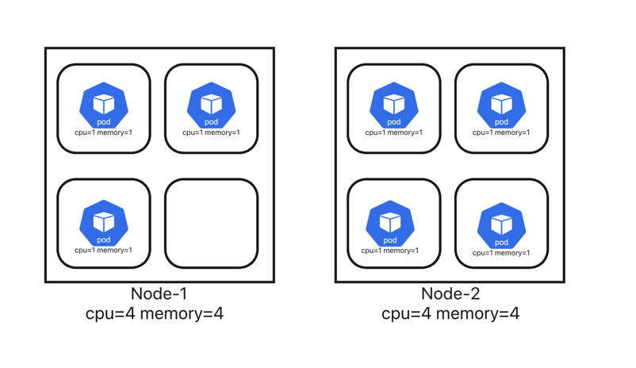
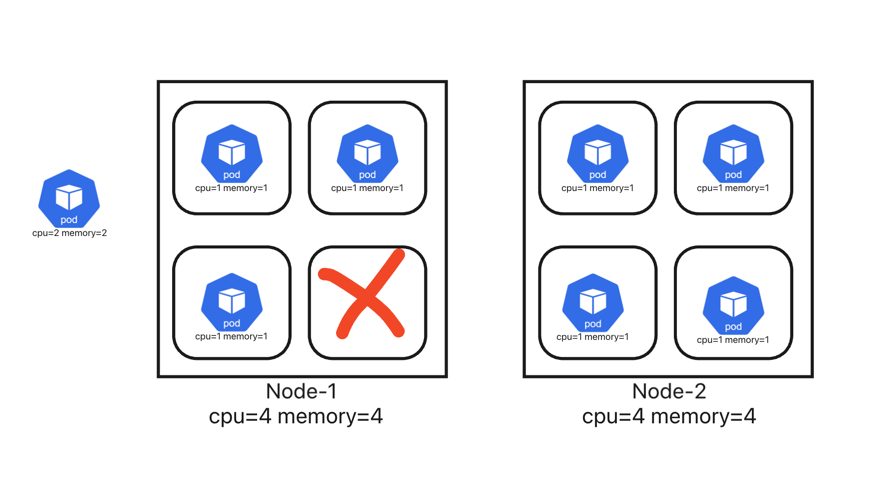

# Kubernetes Requests and Limits





## What's the Deal with Requests & Limits?
Think of your Kubernetes cluster as a bustling city and pods as tenants in an apartment building. Each tenant (pod) requires specific resources like CPU and memory to function:

**1.Requests:** This is the minimum amount of resources a pod needs to operate smoothly. Think of it as a guaranteed reservation for the pod.
**2.Limits:** This is the maximum amount of resources a pod can use. It acts as a safety cap to prevent any pod from consuming more than its fair share and disrupting others.


```commandline
Apply the metric-server.yaml file
```

```yaml
apiVersion: v1
kind: Pod
metadata:
  name: memory-test-1
  namespace: mem-testing
spec:
  containers:
  - name: memory-demo
    image: polinux/stress
    resources:
      requests:
        memory: "250Mi"
      limits:
        memory: "250Mi"
    command: ["stress"]
    args: ["--vm","1","--vm-bytes","150M","--vm-hang","1"]
```
```commandline
12:13:51 manojkrishnappa@Manojs-MacBook-Pro 03-REquest_and_Limit ±|main ✗|→ kubectl apply -f test1.yaml -n mem-testing
kubectl --context kind-manoj-cka-cluster apply -f test1.yaml -n mem-testing
pod/memory-test-1 created
12:14:19 manojkrishnappa@Manojs-MacBook-Pro 03-REquest_and_Limit ±|main ✗|→ kubectl get pods -n mem-testing
kubectl --context kind-manoj-cka-cluster get pods -n mem-testing
NAME            READY   STATUS    RESTARTS   AGE
memory-test-1   1/1     Running   0          21s
12:14:40 manojkrishnappa@Manojs-MacBook-Pro 03-REquest_and_Limit ±|main ✗|→ kubectl describe pod memory-test-1  -n mem-testing
kubectl --context kind-manoj-cka-cluster describe pod memory-test-1 -n mem-testing
Name:             memory-test-1
Namespace:        mem-testing
Priority:         0
Service Account:  default
Node:             manoj-cka-cluster-worker3/172.18.0.5
Start Time:       Sat, 08 Feb 2025 12:14:19 +0530
Labels:           <none>
Annotations:      <none>
Status:           Running
IP:               10.244.1.2
IPs:
  IP:  10.244.1.2
Containers:
  memory-demo:
    Container ID:  containerd://eb163c24e9d7304ff7181bba7e87185016291f9fdff65b891aa96d096c4ce7dd
    Image:         polinux/stress
    Image ID:      docker.io/polinux/stress@sha256:b6144f84f9c15dac80deb48d3a646b55c7043ab1d83ea0a697c09097aaad21aa
    Port:          <none>
    Host Port:     <none>
    Command:
      stress
    Args:
      --vm
      1
      --vm-bytes
      150M
      --vm-hang
      1
    State:          Running
      Started:      Sat, 08 Feb 2025 12:14:28 +0530
    Ready:          True
    Restart Count:  0
    Limits:
      memory:  250Mi
    Requests:
      memory:     250Mi
    Environment:  <none>
    Mounts:
      /var/run/secrets/kubernetes.io/serviceaccount from kube-api-access-2fggd (ro)
Conditions:
  Type                        Status
  PodReadyToStartContainers   True 
  Initialized                 True 
  Ready                       True 
  ContainersReady             True 
  PodScheduled                True 
Volumes:
  kube-api-access-2fggd:
    Type:                    Projected (a volume that contains injected data from multiple sources)
    TokenExpirationSeconds:  3607
    ConfigMapName:           kube-root-ca.crt
    ConfigMapOptional:       <nil>
    DownwardAPI:             true
QoS Class:                   Burstable
Node-Selectors:              <none>
Tolerations:                 node.kubernetes.io/not-ready:NoExecute op=Exists for 300s
                             node.kubernetes.io/unreachable:NoExecute op=Exists for 300s
Events:
  Type    Reason     Age   From               Message
  ----    ------     ----  ----               -------
  Normal  Scheduled  33s   default-scheduler  Successfully assigned mem-testing/memory-test-1 to manoj-cka-cluster-worker3
  Normal  Pulling    33s   kubelet            Pulling image "polinux/stress"
  Normal  Pulled     25s   kubelet            Successfully pulled image "polinux/stress" in 8.023s (8.023s including waiting). Image size: 4041495 bytes.
  Normal  Created    25s   kubelet            Created container memory-demo
  Normal  Started    24s   kubelet            Started container memory-demo

```

```yaml
apiVersion: v1
kind: Pod
metadata:
  name: memory-test-2
  namespace: mem-testing
spec:
  containers:
  - name: memory-demo
    image: polinux/stress
    resources:
      requests:
        memory: "50Mi"
      limits:
        memory: "250Mi"
    command: ["stress"]
    args: ["--vm","1","--vm-bytes","150M","--vm-hang","1"]
```
```commandline
12:16:20 manojkrishnappa@Manojs-MacBook-Pro 03-REquest_and_Limit ±|main ✗|→ kubectl apply -f test2.yml  -n mem-testing
kubectl --context kind-manoj-cka-cluster apply -f test2.yml -n mem-testing
pod/memory-test-2 created
12:16:31 manojkrishnappa@Manojs-MacBook-Pro 03-REquest_and_Limit ±|main ✗|→ kubectl get pods -n mem-testing
kubectl --context kind-manoj-cka-cluster get pods -n mem-testing
NAME            READY   STATUS              RESTARTS   AGE
memory-test-1   1/1     Running             0          2m16s
memory-test-2   0/1     ContainerCreating   0          4s
12:16:35 manojkrishnappa@Manojs-MacBook-Pro 03-REquest_and_Limit ±|main ✗|→ kubectl get pods -n mem-testing
kubectl --context kind-manoj-cka-cluster get pods -n mem-testing
NAME            READY   STATUS              RESTARTS   AGE
memory-test-1   1/1     Running             0          2m18s
memory-test-2   0/1     ContainerCreating   0          6s
12:16:37 manojkrishnappa@Manojs-MacBook-Pro 03-REquest_and_Limit ±|main ✗|→ kubectl get pods -n mem-testing
kubectl --context kind-manoj-cka-cluster get pods -n mem-testing
12:16:39 manojkrishnappa@Manojs-MacBook-Pro 03-REquest_and_Limit ±|main ✗|→ kubectl get pods -n mem-testing
kubectl --context kind-manoj-cka-cluster get pods -n mem-testing
NAME            READY   STATUS    RESTARTS   AGE
memory-test-1   1/1     Running   0          2m22s
memory-test-2   1/1     Running   0          10s
12:16:40 manojkrishnappa@Manojs-MacBook-Pro 03-REquest_and_Limit ±|main ✗|→ 
12:16:40 manojkrishnappa@Manojs-MacBook-Pro 03-REquest_and_Limit ±|main ✗|→ kubectl top pods  -n mem-testing
kubectl --context kind-manoj-cka-cluster top pods -n mem-testing
NAME            CPU(cores)   MEMORY(bytes)   
memory-test-1   61m          151Mi           
memory-test-2   48m          3Mi   
```

```yaml
apiVersion: v1
kind: Pod
metadata:
  name: memory-test-3
  namespace: mem-testing
spec:
  containers:
  - name: memory-demo
    image: polinux/stress
    resources:
      requests:
        memory: "2G"
      limits:
        memory: "2G"
    command: ["stress"]
    args: ["--vm","1","--vm-bytes","150M","--vm-hang","1"]
```
```commandline
C12:19:12 manojkrishnappa@Manojs-MacBook-Pro 03-REquest_and_Limit ±|main ✗|→ kubectl apply -f test3.yml -n mem-testing
kubectl --context kind-manoj-cka-cluster apply -f test3.yml -n mem-testing
pod/memory-test-3 created
12:19:21 manojkrishnappa@Manojs-MacBook-Pro 03-REquest_and_Limit ±|main ✗|→ kubectl get pods -n mem-testing
kubectl --context kind-manoj-cka-cluster get pods -n mem-testing
NAME            READY   STATUS    RESTARTS   AGE
memory-test-1   1/1     Running   0          5m6s
memory-test-2   1/1     Running   0          2m54s
memory-test-3   0/1     Pending   0          4s
12:19:25 manojkrishnappa@Manojs-MacBook-Pro 03-REquest_and_Limit ±|main ✗|→ kubectl get pods -n mem-testing
kubectl --context kind-manoj-cka-cluster get pods -n mem-testing
NAME            READY   STATUS    RESTARTS   AGE
memory-test-1   1/1     Running   0          5m8s
memory-test-2   1/1     Running   0          2m56s
memory-test-3   0/1     Pending   0          6s
12:19:27 manojkrishnappa@Manojs-MacBook-Pro 03-REquest_and_Limit ±|main ✗|→ kubectl get pods -n mem-testing
kubectl --context kind-manoj-cka-cluster get pods -n mem-testing
NAME            READY   STATUS    RESTARTS   AGE
memory-test-1   1/1     Running   0          5m10s
memory-test-2   1/1     Running   0          2m58s
memory-test-3   0/1     Pending   0          8s
12:19:28 manojkrishnappa@Manojs-MacBook-Pro 03-REquest_and_Limit ±|main ✗|→ kubectl get pods -n mem-testing
kubectl --context kind-manoj-cka-cluster get pods -n mem-testing
NAME            READY   STATUS    RESTARTS   AGE
memory-test-1   1/1     Running   0          5m11s
memory-test-2   1/1     Running   0          2m59s
memory-test-3   0/1     Pending   0          9s
12:19:30 manojkrishnappa@Manojs-MacBook-Pro 03-REquest_and_Limit ±|main ✗|→ 
12:19:30 manojkrishnappa@Manojs-MacBook-Pro 03-REquest_and_Limit ±|main ✗|→ kubectl get pods -n mem-testing
kubectl --context kind-manoj-cka-cluster get pods -n mem-testing
NAME            READY   STATUS    RESTARTS   AGE
memory-test-1   1/1     Running   0          5m15s
memory-test-2   1/1     Running   0          3m3s
memory-test-3   0/1     Pending   0          13s
12:19:34 manojkrishnappa@Manojs-MacBook-Pro 03-REquest_and_Limit ±|main ✗|→ kubectl describe pod memory-test-3 -n mem-testing
kubectl --context kind-manoj-cka-cluster describe pod memory-test-3 -n mem-testing
Name:             memory-test-3
Namespace:        mem-testing
Priority:         0
Service Account:  default
Node:             <none>
Labels:           <none>
Annotations:      <none>
Status:           Pending
IP:               
IPs:              <none>
Containers:
  memory-demo:
    Image:      polinux/stress
    Port:       <none>
    Host Port:  <none>
    Command:
      stress
    Args:
      --vm
      1
      --vm-bytes
      150M
      --vm-hang
      1
    Limits:
      memory:  2G
    Requests:
      memory:     2G
    Environment:  <none>
    Mounts:
      /var/run/secrets/kubernetes.io/serviceaccount from kube-api-access-cmq78 (ro)
Conditions:
  Type           Status
  PodScheduled   False 
Volumes:
  kube-api-access-cmq78:
    Type:                    Projected (a volume that contains injected data from multiple sources)
    TokenExpirationSeconds:  3607
    ConfigMapName:           kube-root-ca.crt
    ConfigMapOptional:       <nil>
    DownwardAPI:             true
QoS Class:                   Burstable
Node-Selectors:              <none>
Tolerations:                 node.kubernetes.io/not-ready:NoExecute op=Exists for 300s
                             node.kubernetes.io/unreachable:NoExecute op=Exists for 300s
Events:
  Type     Reason            Age   From               Message
  ----     ------            ----  ----               -------
  Warning  FailedScheduling  25s   default-scheduler  0/4 nodes are available: 1 node(s) had untolerated taint {node-role.kubernetes.io/control-plane: }, 3 Insufficient memory. preemption: 0/4 nodes are available: 1 Preemption is not helpful for scheduling, 3 No preemption victims found for incoming pod.
12:19:47 manojkrishnappa@Manojs-MacBook-Pro 03-REquest_and_Limit ±|main ✗|→ 
12:19:47 manojkrishnappa@Manojs-MacBook-Pro 03-REquest_and_Limit ±|main ✗|→ kubectl get pods -n mem-testing
kubectl --context kind-manoj-cka-cluster get pods -n mem-testing
NAME            READY   STATUS    RESTARTS   AGE
memory-test-1   1/1     Running   0          6m6s
memory-test-2   1/1     Running   0          3m54s
memory-test-3   0/1     Pending   0          64s
12:20:25 manojkrishnappa@Manojs-MacBook-Pro 03-REquest_and_Limit ±|main ✗|→ kubectl top pods  -n mem-testing
kubectl --context kind-manoj-cka-cluster top pods -n mem-testing
NAME            CPU(cores)   MEMORY(bytes)   
memory-test-1   47m          151Mi           
memory-test-2   47m          151Mi           

```
