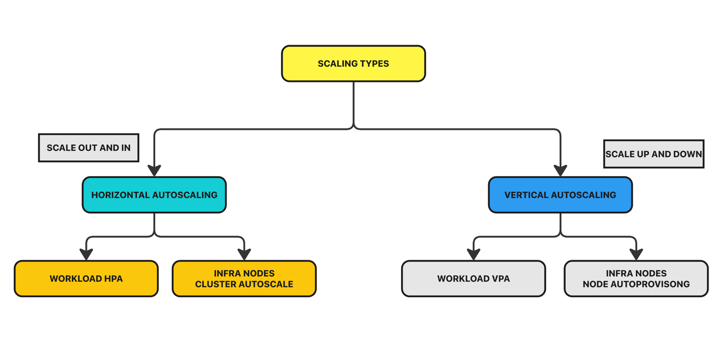
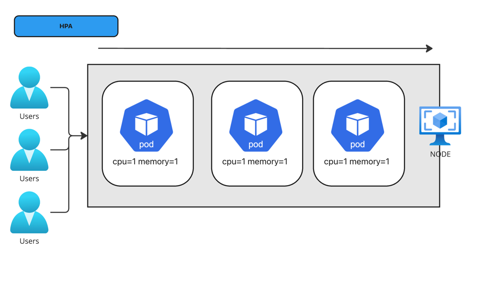
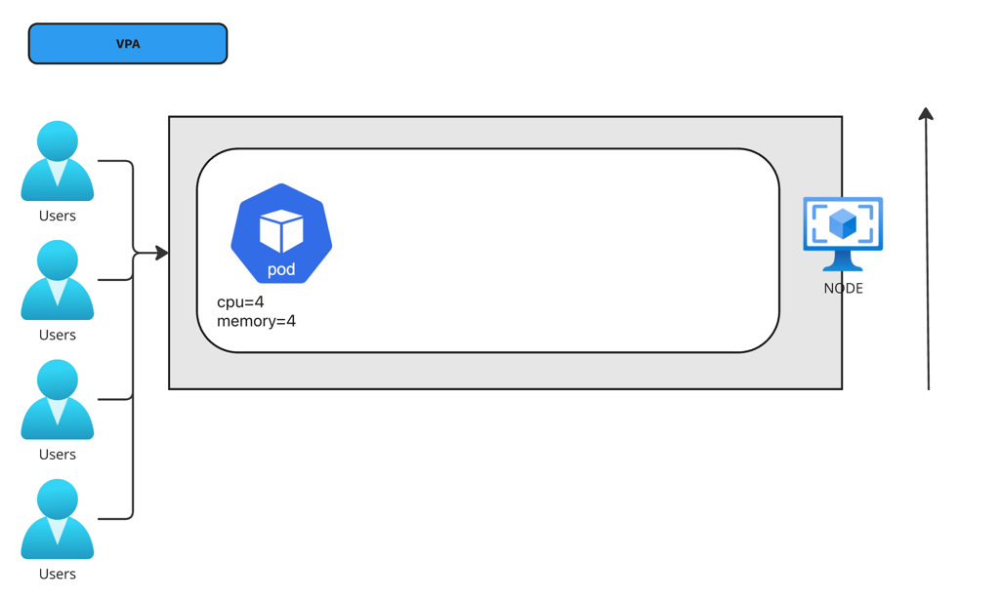
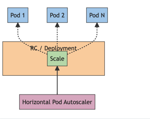

# Kubernetes Autoscaling | HPA Vs VPA

## AUTOSCALING TYPES






### CREATEING THE DEPLOYMENT.YML
```yaml
apiVersion: apps/v1
kind: Deployment
metadata:
  name: php-apache
spec:
  selector:
    matchLabels:
      run: php-apache
  template:
    metadata:
      labels:
        run: php-apache
    spec:
      containers:
      - name: php-apache
        image: registry.k8s.io/hpa-example
        ports:
        - containerPort: 80
        resources:
          limits:
            cpu: 500m
          requests:
            cpu: 200m
---
apiVersion: v1
kind: Service
metadata:
  name: php-apache
  labels:
    run: php-apache
spec:
  ports:
  - port: 80
  selector:
    run: php-apache
```

```yaml
apiVersion: autoscaling/v2
kind: HorizontalPodAutoscaler
metadata:
  name: php-apache
spec:
  scaleTargetRef:
    apiVersion: apps/v1
    kind: Deployment
    name: php-apache
  minReplicas: 1
  maxReplicas: 10
  metrics:
  - type: Resource
    resource:
      name: cpu
      target:
        type: Utilization
        averageUtilization: 50
```
```commandline
07:07:43 manojkrishnappa@Manojs-MacBook-Pro 04-AUTOSCALING ±|main ✗|→ kubectl get pods
kubectl --context kind-manoj-cka-cluster -n default get pods
NAME                         READY   STATUS    RESTARTS   AGE
php-apache-d87b7ff46-zv78n   1/1     Running   0          7h11m
07:58:21 manojkrishnappa@Manojs-MacBook-Pro 04-AUTOSCALING ±|main ✗|→ ls
HPA.yml         NOTES.MD        deployment.yml  img.png         img_1.png       img_2.png       img_3.png
07:58:52 manojkrishnappa@Manojs-MacBook-Pro 04-AUTOSCALING ±|main ✗|→ kubectl apply -f HPA.yml 
kubectl --context kind-manoj-cka-cluster -n default apply -f HPA.yml
horizontalpodautoscaler.autoscaling/php-apache created
07:59:01 manojkrishnappa@Manojs-MacBook-Pro 04-AUTOSCALING ±|main ✗|→ kubectl get pods
kubectl --context kind-manoj-cka-cluster -n default get pods
NAME                         READY   STATUS    RESTARTS   AGE
php-apache-d87b7ff46-zv78n   1/1     Running   0          7h12m
07:59:07 manojkrishnappa@Manojs-MacBook-Pro 04-AUTOSCALING ±|main ✗|→ kubectl get hpa
kubectl --context kind-manoj-cka-cluster -n default get hpa
NAME         REFERENCE               TARGETS              MINPODS   MAXPODS   REPLICAS   AGE
php-apache   Deployment/php-apache   cpu: <unknown>/50%   1         10        0          12s

```
# To increse load in the pods

```commandline
kubectl run -i --tty load-generator --rm --image=busybox:1.28 --restart=Never -- /bin/sh -c "while sleep 0.01; do wget -q -O- http://php-apache; done"
```

```commandline
08:03:39 manojkrishnappa@Manojs-MacBook-Pro kubernetes-docs ±|main ✗|→ kubectl get hpa --watch
kubectl --context kind-manoj-cka-cluster -n default get hpa --watch
NAME         REFERENCE               TARGETS        MINPODS   MAXPODS   REPLICAS   AGE
php-apache   Deployment/php-apache   cpu: 47%/50%   1         10        8          4m58s
php-apache   Deployment/php-apache   cpu: 45%/50%   1         10        8          5m1s
php-apache   Deployment/php-apache   cpu: 49%/50%   1         10        8          5m16s
^C08:04:17 manojkrishnappa@Manojs-MacBook-Pro kubernetes-docs ±|main ✗|→ kubectl get pods --watch
kubectl --context kind-manoj-cka-cluster -n default get pods --watch
NAME                         READY   STATUS    RESTARTS   AGE
load-generator               1/1     Running   0          4m27s
php-apache-d87b7ff46-4ggfg   1/1     Running   0          2m58s
php-apache-d87b7ff46-7phvn   1/1     Running   0          3m43s
php-apache-d87b7ff46-8hkfd   1/1     Running   0          3m43s
php-apache-d87b7ff46-drz2t   1/1     Running   0          3m28s
php-apache-d87b7ff46-r7w58   1/1     Running   0          3m43s
php-apache-d87b7ff46-vlg9v   1/1     Running   0          118s
php-apache-d87b7ff46-wxwt5   1/1     Running   0          2m58s
php-apache-d87b7ff46-zv78n   1/1     Running   0          7h17m
```


